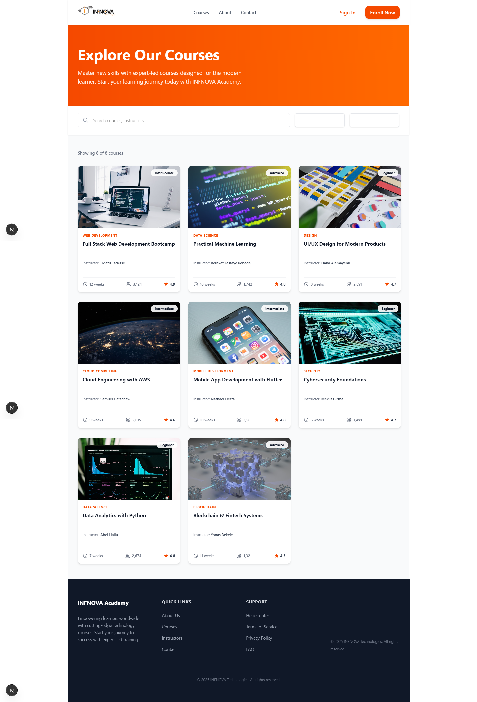
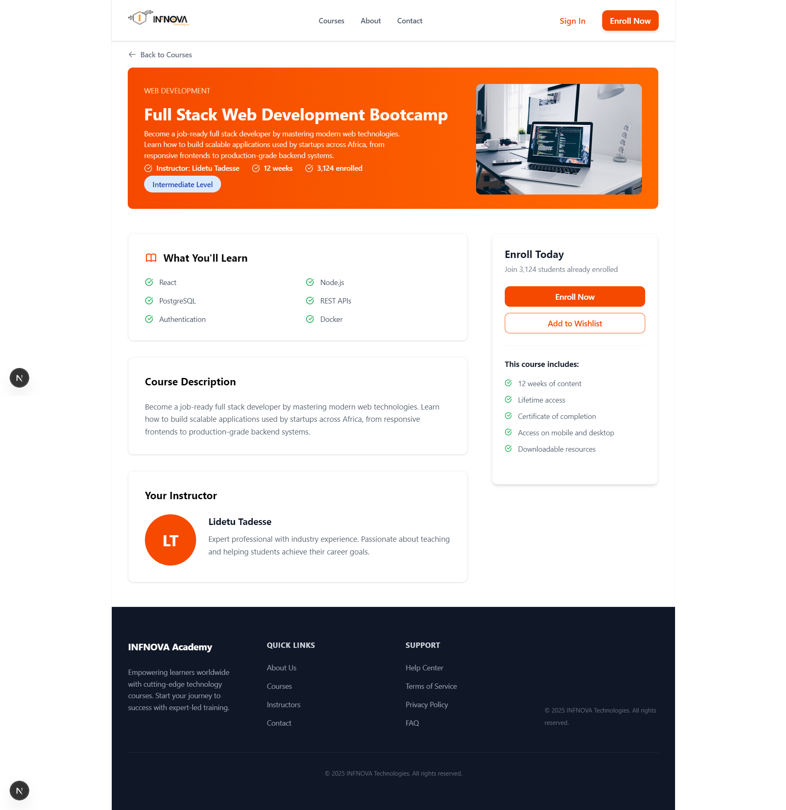

# INFNOVA Academy - Online LMS Platform

A premium, pixel-perfect Learning Management System built with **Next.js 15**, **TypeScript**, and **Tailwind CSS**. This project was developed as part of an internship technical assessment, focusing on high-fidelity design implementation and dynamic API integration.

## 🚀 Key Features

- **Direct Entry**: Automatic landing page redirect to the Course List for immediate impact.
- **Pixel-Perfect UI**: Strictly adheres to Figma specifications (1101px boxed layout).
- **Dynamic Course Engine**: Real-time data fetching from a REST API with server-side rendering.
- **Responsive Navigation**: Custom header with precise logo and action button dimensions.
- **Detailed Course Views**: Dynamic routing (`/courses/[id]`) with specialized layouts for course content and instructor details.
- **Optimized Performance**: Next.js Image optimization and tailored skeleton loading states.

## 🛠️ Tech Stack

- **Framework**: [Next.js 15+](https://nextjs.org/) (App Router)
- **Language**: [TypeScript](https://www.typescriptlang.org/)
- **Styling**: [Tailwind CSS v4](https://tailwindcss.com/)
- **Typography**: [Inter](https://fonts.google.com/specimen/Inter) (Google Fonts)
- **Icons/Assets**: Custom brand assets and Unsplash integration.

## 📸 Screenshots

### 1. Course List Page

_Boxed 1101px layout featuring our dynamic course grid._


### 2. Course Detail Page

_Premium hero section with specialized sidebar and "What You'll Learn" grid._


## 🏁 Getting Started

1.  **Clone & Install**:

    ```bash
    git clone [repository-url]
    cd infnova-academy
    pnpm install
    ```

2.  **Environment**:
    The app uses the following base API: `https://infnova-course-api.vercel.app/api`. Ensure you have internet access for image and data fetching.

3.  **Run Development**:

    ```bash
    pnpm dev
    ```

4.  **Build for Production**:
    ```bash
    pnpm build
    pnpm start
    ```

## 📐 Design Specifications

- **Canvas Width**: 1101px (Centered)
- **Primary Color**: `#F54900` (INFNOVA Orange)
- **Typography**: Inter (400, 500, 700)
- **Components**: Box-shadowed cards, sticky navbars, and structured footers.

---

_Developed for **INFNOVA Technologies** Internship Assessment._
